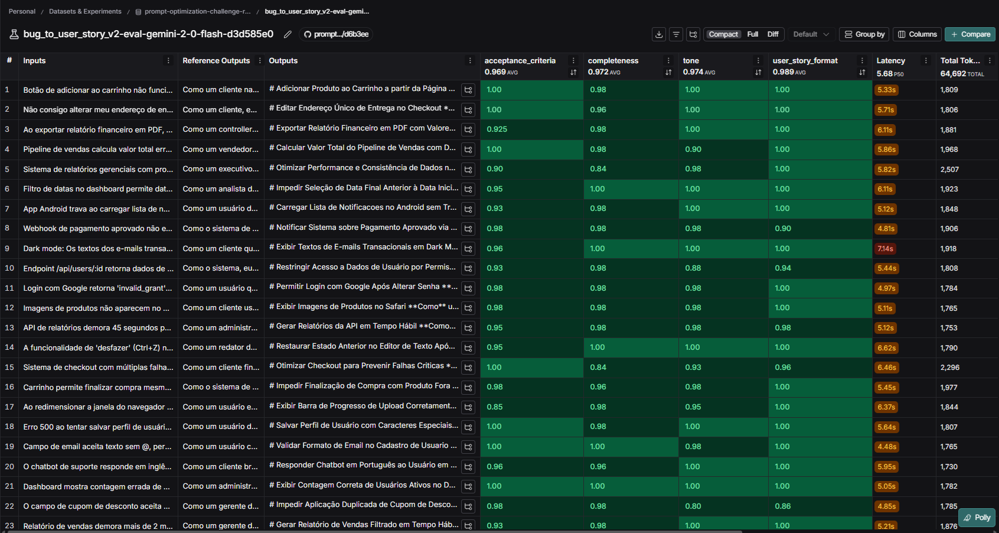
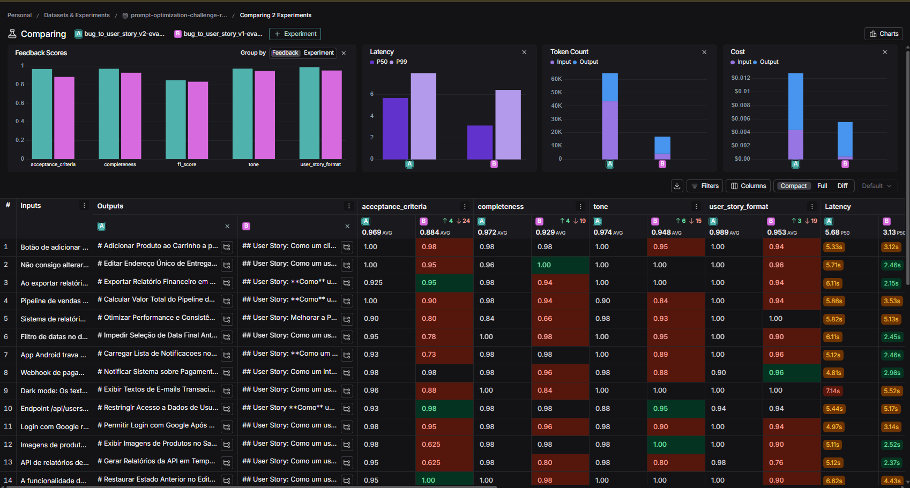

# Prompt Evaluation: Bug to User Story

Este projeto implementa um pipeline completo de Engenharia de Prompt para converter **Bug Reports** em **User Stories** no padrão INVEST, utilizando **LangChain** e **LangSmith** para avaliação contínua.

## 🎯 Objetivo
Transformar relatos de bugs técnicos (muitas vezes curtos ou confusos) em User Stories estruturadas, com critérios de aceite claros e contexto técnico preservado.

## 🛠️ Stack Tecnológico
- **Linguagem**: Python 3.9+
- **Orquestração**: LangChain
- **Observabilidade**: LangSmith
- **LLM (Generator & Evaluator)**: Google Gemini 2.5 Flash
- **Métricas**: Customizadas (Tone, Acceptance Criteria, User Story Format, Completeness)

## 🔄 Técnicas de Prompt Engineering Aplicadas

O prompt V2 utiliza **4 técnicas avançadas** combinadas para maximizar a qualidade:

### 1. Role Prompting (Persona)
O prompt define uma persona especializada de **Product Owner Sênior + Analista de QA** com 15 anos de experiência. Isso direciona o LLM a adotar um vocabulário técnico adequado e a priorizar valor de negócio sobre detalhes de implementação.

> **Por quê?** Sem persona, o modelo tende a gerar User Stories genéricas e com tom de chatbot. Com a persona, o tom profissional atingiu **1.00** (nota máxima).

### 2. Chain of Thought (CoT)
Instruções explícitas de raciocínio passo a passo: Análise do Problema → Extração de Dados → Definição de Valor → Mapeamento de Cenários. Isso força o modelo a "pensar antes de escrever".

> **Por quê?** O CoT evita que o modelo pule diretamente para a resposta, reduzindo alucinações e melhorando a completude dos cenários gerados.

### 3. Few-Shot Learning
Um exemplo completo de entrada (Bug Report) e saída esperada (User Story com Critérios de Aceite Gherkin) é fornecido dentro do prompt.

> **Por quê?** O exemplo serve como "molde" para o formato, garantindo que o modelo reproduza a estrutura Markdown com `# Título`, `**Como**/**Eu quero**/**Para que**` e `Dado/Quando/Então`.

### 4. XML Isolation (Estruturação de Saída)
O raciocínio do modelo é encapsulado em tags `<thinking>` e a User Story final em `<user_story>`. Apenas o conteúdo dentro de `<user_story>` é avaliado.

> **Por quê?** Modelos mais recentes (como o Gemini 2.5 Flash) tendem a "conversar" antes de responder. O XML separa pensamento de entrega, permitindo que o avaliador ignore o raciocínio e avalie apenas o produto final.

## 📊 Resultados da Avaliação (V1 vs V2)

O pipeline utiliza o **LLM-as-a-Judge** (Gemini 2.5 Flash) para avaliar as stories geradas contra um dataset de 10 bug reports de referência.

| Métrica | V1 (Baseline) | **V2 (Optimized)** | Meta (>0.9) |
|---|---|---|---|
| **Tone** | 0.99 | **1.00** | ✅ |
| **Completeness** | 0.99 | **0.99** | ✅ |
| **User Story Format** | 0.97 | **0.99** | ✅ |
| **Acceptance Criteria** | 0.96 | **0.97** | ✅ |

### 🔗 Dashboard LangSmith


- **Experimento V1 (Baseline)**: [Ver no LangSmith](https://smith.langchain.com/o/4edf22f3-ecb6-499b-b514-311998f18731/datasets/1d2bae30-bdaa-4f4f-8827-5c29301afbf6/compare?selectedSessions=6b391136-c76e-44f4-96fd-4030d084eb4c)
- **Experimento V2 (Otimizado)**: [Ver no LangSmith](https://smith.langchain.com/o/4edf22f3-ecb6-499b-b514-311998f18731/datasets/1d2bae30-bdaa-4f4f-8827-5c29301afbf6/compare?selectedSessions=e45a9d2e-4729-4080-9b94-6425cfd6b1a9)
- **Comparação V1 vs V2**: [Ver no LangSmith](https://smith.langchain.com/o/4edf22f3-ecb6-499b-b514-311998f18731/datasets/1d2bae30-bdaa-4f4f-8827-5c29301afbf6/compare?selectedSessions=e45a9d2e-4729-4080-9b94-6425cfd6b1a9%2C6b391136-c76e-44f4-96fd-4030d084eb4c&source=e45a9d2e-4729-4080-9b94-6425cfd6b1a9)

### 📸 Screenshots





## 🚀 Como Executar

### 1. Instalação
```bash
pip install -r requirements.txt
```

### 2. Configuração
Crie um arquivo `.env` baseado no `.env.example`:
```bash
cp .env.example .env
# Edite o .env com suas chaves de API
```

### 3. Pull do Prompt Original
```bash
python src/pull_prompts.py
```

### 4. Push do Prompt Otimizado
```bash
python src/push_prompts.py
```

### 5. Rodar Avaliação

Avaliar o prompt otimizado (V2):
```bash
python src/evaluate.py --model gemini-2.5-flash
```

Comparar V1 vs V2:
```bash
python src/compare_prompts.py --model gemini-2.5-flash
```

### 6. Testes Unitários
```bash
pytest tests/
```

## 📂 Estrutura do Projeto

```
prompt-evaluation-langchain-langsmith/
├── prompts/
│   ├── bug_to_user_story_v1.yml      # Prompt Original (Baseline)
│   └── bug_to_user_story_v2.yml      # Prompt Otimizado (Final)
├── src/
│   ├── pull_prompts.py               # Script de captura do LangSmith Hub
│   ├── push_prompts.py               # Script de publicação no LangSmith Hub
│   ├── evaluate.py                   # Motor de avaliação (LLM-as-Judge)
│   ├── compare_prompts.py            # Comparação V1 vs V2
│   ├── metrics.py                    # Lógica das métricas customizadas
│   └── utils.py                      # Utilitários e configuração de LLM
├── datasets/
│   └── bug_to_user_story.jsonl       # Dataset de avaliação (10 exemplos)
├── tests/
│   └── test_prompts.py               # Testes automatizados (24 testes)
├── docs/                             # Documentação do desafio
├── .env.example                      # Template de configuração
├── requirements.txt                  # Dependências Python
└── README.md                         # Este arquivo
```

---

## 📋 Relatórios Gerados

- [**Relatório de Comparação V1 vs V2**](comparison_report.md) — Resultado da avaliação lado a lado dos prompts.
- [**Relatório de Testes**](test_report.md) — Resultado do `pytest` com os 6 critérios de validação. *(Regenerado automaticamente a cada execução)*
- [**Relatório de Compliance**](compliance_report.md) — Verificação de conformidade com todos os requisitos do desafio.

---
**Desenvolvido como parte do Desafio Técnico de Prompt Engineering.**
